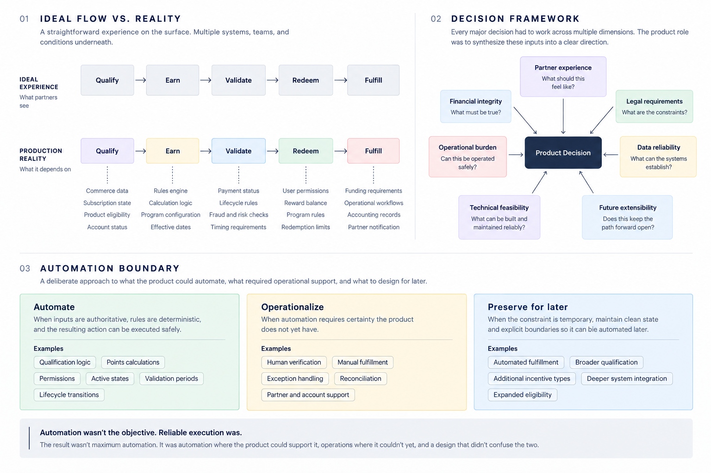

# Shipping Through Imperfect Systems

> **About this case:** Based on professional experience. Business rules, system details, examples, and implementation specifics have been intentionally generalized or altered to protect confidential information.

## The challenge

This case examines a rewards product built within an established B2B commerce ecosystem, where externally funded incentives, existing platform dependencies, and a fixed delivery timeline created constraints that weren't obvious from the initial product scope.

Product ownership spanned the partner and operational experiences, with decisions requiring collaboration across **Engineering · Architecture · Finance · Data · Partner Experience · Legal · Commerce**.

What initially appeared to be a relatively contained rewards capability became a broader systems problem.

The ideal experience was straightforward:

**Qualify → Earn → Validate → Redeem → Fulfill**

Making each of those steps trustworthy was not.

The surrounding systems had been designed for commerce, billing, subscriptions, and financial operations, not specifically to answer every question a rewards program needed to ask.

The central challenge became:

> **How do you ship a trustworthy product when the ideal experience depends on capabilities that don't all exist yet?**

  

---

## The ideal product wasn't the immediately shippable product

A fully automated experience was the obvious destination.

A qualifying purchase would be recognized automatically. Rewards would become available at the appropriate time. An authorized user could redeem them. Value would be fulfilled without additional intervention.

But automation is only reliable when the system can reliably establish the facts behind the decision.

The problem therefore separated into three questions:

**What can be automated confidently? · What needs controlled operations today? · What should preserve a path to automation later?**

That distinction shaped decisions from pilot through broader launch.

---

## Decision 01 · Expand the product boundary

Building the rewards capability internally meant the product surface extended beyond partner-facing earning and redemption experiences.

The program also needed to be operated safely.

That introduced capabilities not fully represented by the original product boundary:

**Lifecycle controls · Reward management · Permissions · Exception handling · Operational visibility**

An administrative experience was prioritized alongside the partner experience rather than treating these needs as post-launch operations work.

### The tradeoff

This increased the product surface required for launch.

The alternative was a platform whose core behaviors depended too heavily on engineering intervention or disconnected operational processes.

The administrative experience therefore became part of the product architecture rather than auxiliary tooling added afterward.

---

## Decision 02 · Make qualification defensible

A seemingly simple business concept does not always map cleanly to a single system event.

A qualifying purchase needed to satisfy multiple business, funding, lifecycle, and timing conditions. Early production behavior demonstrated that relying on one commerce event alone could produce an incomplete representation of that activity.

In practice, activity that looked like a single commercial event could contain multiple underlying lifecycle changes, while payment status alone could not always establish whether specific activity met the program's funding requirements. The first model was deterministic, but it was too coarse.

The qualification model evolved by working across domain teams to determine which available signals could support deterministic product decisions.

That created an important tradeoff:

**Broader theoretical coverage · vs. · Narrower, defensible qualification**

Where the available evidence couldn't support a decision with sufficient confidence, I favored deterministic rules the platform could explain and defend rather than expanding eligibility through assumptions.

The goal wasn't to pretend ambiguity didn't exist.

It was to decide **what the product was allowed to claim it knew.**

---

## Decision 03 · Decide where automation should stop

Automation wasn't the objective.

**Reliable execution was.**

The boundary depended on the quality of the inputs, the consequences of getting a decision wrong, and whether a safer operational alternative existed.

### Automate

When inputs were authoritative, rules were deterministic, and the resulting action could be executed safely.

**Qualification logic · Points calculations · Permissions · Active states · Validation periods · Lifecycle transitions**

### Operationalize

When automation required certainty the product did not yet have.

Controlled operational workflows were preferable to hiding uncertainty behind automation simply to remove a manual step.

### Preserve for later

Manual did not have to mean permanent.

Where operations were necessary, clean system state and explicit boundaries were preserved so an operational step could eventually be replaced without redesigning the entire rewards lifecycle.

The result wasn't maximum automation.

It was **automation where the product could support it, operations where it couldn't yet, and a design that didn't confuse the two.**

---

## Pilot was evidence

The pilot wasn't simply a smaller version of the broader launch.

It exposed assumptions that looked reasonable during design but behaved differently under real conditions.

### Pilot surfaced

**Qualification assumptions · Operational gaps · Data ambiguity · Missing guardrails · Lifecycle edge cases**

### What changed afterward

**Qualification logic · Deterministic guardrails · Lifecycle handling · Operational controls · Automation boundaries**

Just as important were the things deliberately left undone.

Automation wasn't introduced simply to eliminate manual work.

Adjacent incentive capabilities weren't added without the dependencies necessary to operate them responsibly.

And broader launch wasn't made contingent on every surrounding system reaching an ideal future state.

The objective was to use pilot evidence to make the product more reliable without allowing perfect infrastructure to become a prerequisite for shipping.

---

## Making decisions across the system

None of these decisions belonged exclusively to product, technology, finance, or experience.

Major product decisions had to account for:

**Partner experience · Financial integrity · Legal requirements · Data reliability · Technical feasibility · Operational burden · Future extensibility**

That required direct collaboration across **Partner Experience · Finance · Legal · Architecture · Engineering · Data · Commerce** to understand constraints, challenge assumptions, and validate what could reliably be delivered.

The product responsibility was then to synthesize those inputs into actual behavior.

That meant resolving questions such as:

**What should the partner experience? · What must be financially and legally true? · What can the data establish? · What can the technology execute reliably? · What can operations support? · What decision leaves the product better positioned for what comes next?**

Those answers didn't always align.

The work was deciding what to do when they didn't.

---

## What I learned

### Reliable beats theoretically complete

A narrower rule supported by authoritative evidence can be better than broader functionality the system cannot reliably explain or defend.

That applies to automation too. Manual work isn't inherently poor product design when its boundaries are explicit and the system preserves a path to replace it.

### Shipping imperfectly and shipping carelessly are different things

The product that can responsibly ship under real constraints will not always be identical to the product that would be designed from scratch.

**The product work is understanding where that difference matters, making the tradeoffs explicit, and keeping the path forward open.**
